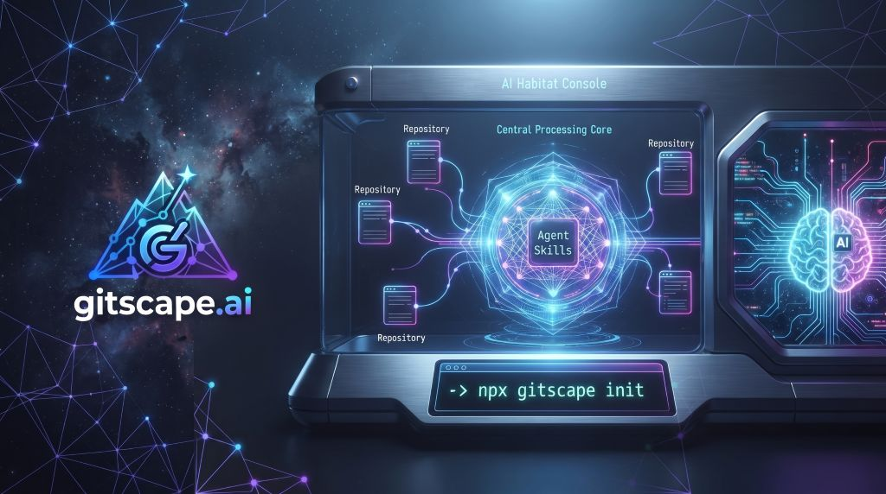
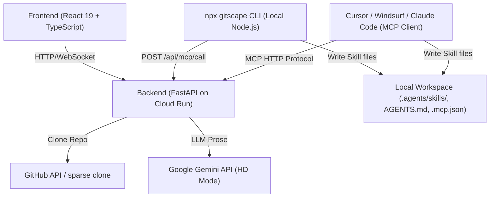

<h1 align="center">GitScape</h1>

<p align="center">
  
</p>

<p align="center">
  <strong>The open-source repository compiler and MCP server for AI agents.</br>
  ​🧪​ Ingest codebases,🔬​ Scan for injections, 🧬 Forge custom Agent Skills instantly.
</p>

<p align="center">
  <a href="https://www.npmjs.com/package/gitscape">
    
  </a>
  <a href="https://www.npmjs.com/package/gitscape">
    
  </a>
  <a href="https://github.com/jmxt3/gitscape.ai/blob/main/LICENSE">
    
  </a>
  
  
</p>

<p align="center">
  <a href="https://gitscape.ai">gitscape.ai</a> •
  <a href="#-features">Features</a> •
  <a href="#-quick-start">Quick Start</a> •
  <a href="#-cli--mcp-integration">CLI & MCP</a> •
  <a href="#-agent-skills-skillforge">Agent Skills</a> •
  <a href="#-architecture">Architecture</a>
</p>

<br/>

---

## 🧠 What is GitScape?

GitScape is an **open-source platform and CLI tool** that generates AI-ready text digests of GitHub codebases, visualizes repository structures with interactive diagrams, and packages any repository into a downloadable **Agent Skill** for Cursor, Windsurf, Claude Code, Agno, and other agent frameworks. It supports both public and private repositories.

Rather than feeding raw, unorganized code to your agent, GitScape compiles a deterministic index of code symbols, dependencies, and setup commands, allowing agents to understand codebases instantly with a fraction of the token budget.

*   ⚡ **npx CLI (`gitscape`)** — Compile any repository on the fly and install it directly into your local agent configuration.
*   🔌 **Model Context Protocol (MCP)** — A built-in MCP server that exposes `install_skill` directly to Cursor, Windsurf, and Claude.
*   🗺️ **Code Digests & Visualizations** — Generate a complete text digest of any repo, and explore its structure with beautiful, interactive D3 diagrams.
*   🧠 **SkillForge Skill Pipeline** — Turn codebases into a progressively-disclosed `SKILL.md` + `references/` package, built deterministically via Tree-sitter.
*   🛡️ **ScapeGuard Security Gate** — Rest easy. Every generated skill is scanned for prompt injection, data exfiltration, and hidden malicious text before export.
*   🔒 **Privacy-First Design** — GitHub tokens stay in your browser; the zero-dependency CLI only requests outbound network access to communicate with the compiler API.
*   📡 **Real-Time Streaming** — WebSocket-powered digest generation with live progress updates.

---

## 🏗️ Architecture

GitScape is built as a monorepo containing three workspaces:

```
GitScape/
├── frontend/  # React 19 + TypeScript frontend (Vite, Tailwind CSS, D3)
├── backend/   # FastAPI backend (Python, Docker, Google Cloud Run)
└── cli/       # Node.js zero-dependency CLI (fetches from API, writes locally)
```

### High-Level System Flow



### Component Structure

```
┌──────────────────────────────────────┐
│              Browser                 │
│                                      │
│  ┌─────────────────────────────────┐ │
│  │ frontend/ (React 19 + Vite)     │ │
│  │                                 │ │
│  │  • Digest viewer (Markdown)     │ │
│  │  • Interactive D3 diagram       │ │
│  │  • Agent Skill export + badge   │ │
│  │  • URL → GitHub repo resolver   │ │
│  └──────────┬──────────────────────┘ │
│             │ HTTP / WebSocket        │
└─────────────┼────────────────────────┘
              │
              ▼
┌──────────────────────────────────────┐
│  backend/ (FastAPI on Cloud Run)     │
│                                      │
│  GET  /converter      → digest+skill │
│  WS   /ws/converter   → streaming    │
│  POST /skill-zip      → .zip (gated) │
│  POST /skill/hd-prose → HD prose     │
│  GET  /export/{fw}    → ADK / Agno   │
│  GET  /mcp/tools      → list tools   │
│  POST /mcp/call       → execute tool │
│                                      │
│  • Clones & analyzes git repos       │
│  • SkillForge skill pipeline         │
│  • Deterministic security scanner    │
│  • Rate limiting (SlowAPI)           │
└──────────────────────────────────────┘
```

---

## 🧠 Agent Skills (SkillForge)

SkillForge turns a repository digest into a high-quality, progressively-disclosed [Agent Skill](https://agentskills.io). The guiding principle is **invert the labor**: do ~90% of the work deterministically from the code's structure, and use an LLM only for short natural-language glue.

### Pipeline
```
ingest → parse → classify → extract → sanitize → assemble → scan (GATE) → package
```

1.  **Parse** — Split the digest by its `FILE:` markers into typed `ContentUnit`s.
2.  **Extract** — Fully deterministic extraction via **Tree-sitter**: public API/symbol index (signatures + one-line purpose), import/dependency graphs, build commands, and deduped code examples.
3.  **Assemble** — A slim, token-budgeted `SKILL.md` plus a `references/` folder containing details on APIs, architecture, examples, setup, and configuration.
4.  **Scan** — A deterministic, zero-LLM security gate.

### Output Package Structure

```
<owner-repo>/
├── SKILL.md            # Slim entry point (token-budgeted, links into references/)
├── references/         # Detailed markdown documentation
│   ├── api.md          # Public API symbols, classes, and signatures
│   ├── architecture.md # Monorepo & workspace structure
│   ├── examples.md     # Mined, deduplicated code examples
│   ├── setup.md        # Commands, prerequisites, and env vars
│   └── config.md       # Configuration files and schemas
├── exporters/          # Autogenerated Google ADK + Agno wrappers
│   └── adk_wrapper.py
└── manifest.json       # Digest hash + provenance metadata + scan status
```

### Compilation Tiers

| Tier | What it does | Requirements | Cost/Latency |
| :--- | :--- | :--- | :--- |
| **Standard** *(Default)* | Complete, valid skill built **deterministically** via Tree-sitter. | None | Instant, free |
| **HD** | Adds rich LLM-written prose descriptions and context. | `GEMINI_API_KEY` (Server-side) | Low latency, high quality |

### 🛡️ ScapeGuard Security Gate

A skill is code your agent trusts. Because codebase digests are repository-derived and untrusted, prompt injections, credentials, or malicious execution scripts planted in READMEs or docstrings could flow directly into your agent's context. 

To prevent this, GitScape compiles and runs every skill through **ScapeGuard**—a pure-Python, deterministic, zero-LLM static analysis security scanner that evaluates skills along **55+ rules** across **9 threat categories**, assigning an **A–F grade** and a numeric **Risk Score** before the skill is exported or installed.

#### 📊 ScapeGuard Grading Scale
*   🟢 **Grade A** (Clean) — No findings or negligible low-severity issues. Automatically allowed.
*   🟡 **Grade B** (Minor Warnings) — Low/medium severity issues. Allowed with user acknowledgement.
*   🟠 **Grade C** (Review Advised) — Multiple warnings or potential risks. Requires explicit user approval (`--force` or manual consent).
*   🔴 **Grade F** (Blocked) — Critical vulnerabilities (e.g., live credentials or remote code execution payloads) are detected. Export and installation are **blocked** (`422 Unprocessable Entity`).

#### 🔒 Key Features
*   **Secrets & Remote Code Blocked:** Live credentials (API keys, tokens, private keys) and execution vectors are caught before they reach your agent.
*   **OWASP Mapping:** Every finding maps directly to the **OWASP Agentic Skills Top 10** (AST01–AST10, 2026) and **OWASP LLM Top 10** for standard compliance auditing.
*   **Audit Artifacts:** Each build/download automatically generates and ships its own `scan-report.json` and a full `scan-report.sarif` audit file in the output folder.
*   **Real-Time Vulnerability Checks:** Integrates real-time querying of the [OSV.dev](https://osv.dev) database to identify and flag known package vulnerabilities during compilation (`scan/osv.py`, `GS-DEP-006/007`).
*   **Tree-sitter Behavioral Analysis:** Uses AST-based semantic analysis of imports, exports, and call graphs (`scan/behavioral.py`, `tslang.py`) to detect suspicious behavior profiles.
*   **Flexible CLI & API Gating:** Enforces installation blocks in local environments via the `safe_to_install` flag, a dedicated `gitscape scan` command, and a public `POST /scan` endpoint.
*   **Extensible Rule Registry & Obfuscation Guard:** Supports custom external rule registries, YARA-based script analysis, and multilingual processing to block obfuscated or non-English injection attempts.

#### 🗂️ The 9 Threat Categories (Taxonomy)
1.  **Prompt Injection** (`GS-INJ` / AST01 / LLM01) — System overrides and instruction hijacking.
2.  **Secrets & Credentials** (`GS-SEC` / AST05 / LLM02) — Embedded API keys, tokens, and credentials.
3.  **Data Exfiltration** (`GS-EXF` / AST04 / LLM02) — Code/instructions exfiltrating data to external hosts.
4.  **Malicious Execution** (`GS-EXE` / AST02 / LLM05) — Remote code execution, destructive commands, or shells.
5.  **Supply Chain** (`GS-DEP` / AST03 / LLM03) — Unpinned, unverifiable, or typosquatted dependencies.
6.  **Obfuscation** (`GS-OBF` / AST06 / LLM01) — Zero-width spaces, homoglyphs, or encoded payloads.
7.  **Untrusted Content** (`GS-CNT` / AST07 / LLM08) — Indirect injection risks from dynamic third-party fetching.
8.  **Excessive Agency** (`GS-AGY` / AST08 / LLM06) — Config tampering, safety-bypass flags, or privilege escalation.
9.  **Structure & Quality** (`GS-STR`) — Completeness and integrity validation for the generated framework skills.

#### 📝 Sample Audit Report (`scan-report.json`)
```json
{
  "status": "PASS",
  "engine": "scapeguard",
  "engine_version": "2.1.0",
  "grade": "A",
  "risk_score": 0,
  "files_scanned": 14,
  "skill_hash": "sha256:9f2c...",
  "license": {
    "spdx_id": "MIT"
  },
  "categories": [
    { "category": "secrets", "status": "PASS", "findings": 0 },
    { "category": "prompt_injection", "status": "PASS", "findings": 0 },
    { "category": "malicious_execution", "status": "PASS", "findings": 0 },
    { "category": "supply_chain", "status": "PASS", "findings": 0 }
    // ...other categories
  ]
}
```

---

## 🏁 Quick Start

### Prerequisites
*   **Node.js** v18+ (for the Frontend and CLI)
*   **Python 3.10+** + [**`uv`**](https://github.com/astral-sh/uv) (for the Backend)
*   **Docker** (Optional, for containerized execution)

---

## 💻 CLI & MCP Integration

GitScape provides two integration methods to bring compiled agent skills directly into your local workspace:

### 🚀 GitScape CLI

The CLI is a fast, zero-dependency Node.js utility that calls the compiler API and writes the compiled skill files directly to your local filesystem.

#### Installation

```bash
# On-demand (Recommended)
npx gitscape [command] [options]

# Global installation
npm install -g gitscape

# Local Development link
cd cli && npm link
```

#### Usage Flow

1.  **Initialize Workspace MCP Config**
    Creates a local `.mcp.json` file pointing to the GitScape server:
    ```bash
    npx gitscape init
    
    # Or point to a local development backend:
    npx gitscape init --server http://127.0.0.1:8081
    ```

2.  **Compile and Install a Skill**
    Compiles any GitHub repository and writes files directly to `.agents/skills/<repo-name>/`:
    ```bash
    npx gitscape https://github.com/owner/repo
    ```
    If the ScapeGuard scan **fails** (grade `F`), the CLI blocks the install and writes nothing — re-run with `--accept-risk` to override.

3.  **Scan a Repository (Without Installing)**
    Runs ScapeGuard against a repo and prints the security verdict (grade, risk score, findings) **without building or installing a skill** — nothing is written. Exits non-zero on a failing scan, so it doubles as a CI gate:
    ```bash
    npx gitscape scan https://github.com/owner/repo
    ```

4.  **CLI Command Options**

| Option | Description |
| :--- | :--- |
| `--token <pat>` | GitHub Personal Access Token (for private repositories) |
| `--accept-risk` | Install even if the security scan fails (grade `F`). Off by default |
| `--type <type>` | Skill type: `code` or `framework` (default: `code`) |
| `--server <url>` | Override compiler API (default: `https://gitscape-143600285956.us-central1.run.app`) |

5.  **Updating a Skill**
    Just re-run the install command. The CLI automatically wipes the target directory to avoid stale files while keeping your `AGENTS.md` registrations intact:
    ```bash
    npx gitscape https://github.com/owner/repo
    ```

6.  **Removing a Skill**
    Deletes the directory and cleans up `AGENTS.md` and `CLAUDE.md`:
    ```bash
    npx gitscape remove <skill_name>
    ```

---

### 🔌 Model Context Protocol (MCP) Server

The MCP Server exposes the `install_skill` and `uninstall_skill` tools, allowing AI agents (Cursor, Claude Code, Windsurf, etc.) to compile and write skill packages directly to your workspace on your behalf.

#### Setup Instructions

##### 1. Cursor & Windsurf
1.  Navigate to **Settings -> Models -> MCP**.
2.  Click **+ Add New MCP Server**.
3.  Configure the settings:
    *   **Name**: `GitScape`
    *   **Type**: `sse`
    *   **URL**: `https://gitscape-143600285956.us-central1.run.app/api/mcp` *(or `http://127.0.0.1:8081/mcp` for local development)*

##### 2. Claude Desktop
Add the following configuration to your `claude_desktop_config.json`:
```json
{
  "mcpServers": {
    "gitscape": {
      "command": "npx",
      "args": [
        "-y",
        "gitscape",
        "init"
      ]
    }
  }
}
```

#### MCP Invocation Examples
Once configured, you can command your AI editor:
*   > *"Compile and install https://github.com/google/adk-python as an agent skill"*
*   > *"Update the google-adk-python skill"*
*   > *"Uninstall the google-adk-python skill"*

---

## 🛠️ Local Development

### 1. Run the Frontend

```bash
cd frontend
npm install
npm run dev
# Running on http://localhost:5173
```

By default, the frontend talks to the production API. To run against a local backend, create `frontend/.env.local`:
```env
VITE_API_HOST=localhost:8081
```

### 2. Run the Backend with `uv`

The backend uses `uv` for ultra-fast dependency management.

```bash
cd backend
# Create and activate virtual environment
uv venv
source .venv/bin/activate  # On Windows: .venv\Scripts\activate

# Install dependencies
uv sync

# Configure environment and run development server
cp .env.example .env
uv run uvicorn main:app --reload --port 8081
# API Docs available at http://localhost:8081/docs
```

### 3. Run Backend Tests

```bash
cd backend
# Quiet output
uv run pytest -q

# Verbose output
uv run pytest -v
```

---

## 🐳 Docker Deployment

Both frontend and backend include optimized `Dockerfiles` for independent deployment:

```bash
# Frontend
cd frontend
docker build -t gitscape_web .
docker run -p 8080:8080 gitscape_web

# Backend
cd backend
docker build -t gitscape_api .
docker run -p 8081:8081 gitscape_api
```

Refer to the individual `README.md` files in [frontend/README.md](file:///c:/Users/jmach/dev/GitScape/frontend/README.md) and [backend/README.md](file:///c:/Users/jmach/dev/GitScape/backend/README.md) for Google Cloud Run and Cloud Build deployment pipelines.

---

## 🧑‍💻 Contributing

We welcome contributions of all kinds!

1.  **Fork** the repository and create your branch:
    ```bash
    git checkout -b feature/your-feature-name
    ```
2.  Work inside the relevant workspace (`frontend/`, `backend/`, or `cli/`).
3.  **Test locally** and ensure all tests pass.
4.  **Open a Pull Request** with a clear description of the change.

---

## 📚 Resources

*   [GitScape Website](https://gitscape.ai/)
*   [Gemini API Key Setup](https://ai.google.dev/gemini-api/docs/api-key)
*   [GitHub Personal Access Tokens](https://github.com/settings/tokens/new)
*   [FastAPI Documentation](https://fastapi.tiangolo.com/)
*   [Google Cloud Run](https://cloud.google.com/run/docs)

---

## 📝 License

This project is licensed under the [Apache License 2.0](LICENSE).

Third-party code and derived detection rules are credited in [THIRD_PARTY_NOTICES.md](THIRD_PARTY_NOTICES.md) — notably the ScapeGuard security scanner, which derives several patterns and scoring constants from [NVIDIA SkillSpector](https://github.com/NVIDIA/SkillSpector) (Apache-2.0).

---

## 🙏 Acknowledgements

Created by [João Machete](https://github.com/jmxt3) and contributors.

If you like this project, please ⭐️ the repo and share your feedback!
