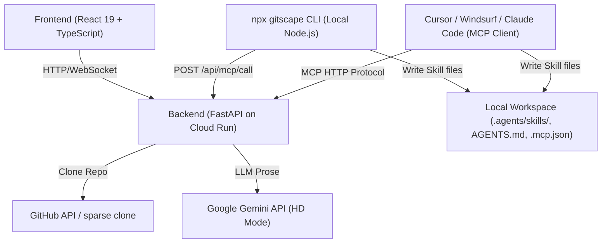

# Git Scape AI

**Understand any GitHub repository in seconds.**


---

## 🚀 Overview

Git Scape AI is an open-source platform that instantly generates AI-ready text digests of GitHub codebases, visualizes repository structures with interactive diagrams, and packages any repo into a downloadable **Agent Skill** for Claude, Google ADK, Agno, and other agent frameworks. It supports both public and private repositories.

- **npx CLI (`gitscape`):** Compile any repository on the fly and install it directly into your local agent configuration.
- **Model Context Protocol (MCP) Server:** Seamlessly run an MCP server locally or remotely to let AI agents install skills directly.
- **Code Digests:** Generate a complete, AI-ready text digest of any GitHub repo.
- **Interactive Visualizations:** Explore your codebase structure with beautiful, interactive diagrams.
- **Agent Skills (SkillForge):** Turn a repo into a progressively-disclosed `SKILL.md` + `references/` package, built **deterministically** (tree-sitter) with an optional LLM "HD" mode.
- **Security Scanner:** Every generated skill is scanned for prompt injection, exfiltration, and hidden text — export is gated behind a visible **PASS / WARN / FAIL** report.
- **Privacy First:** GitHub tokens stay in your browser; the HD model key stays server-side.
- **Real-Time Streaming:** WebSocket-powered digest generation with live progress updates.

---

## 🏗️ Architecture

This is a monorepo containing three workspaces:

```
GitScape/
├── frontend/  # React 19 + TypeScript frontend (Vite, Tailwind CSS, D3)
├── backend/   # FastAPI backend (Python, Docker, Google Cloud Run)
└── cli/       # Node.js zero-dependency CLI (fetches from API, writes locally)
```

### High-Level System Architecture



### How they fit together

```
┌──────────────────────────────────────┐
│              Browser                 │
│                                      │
│  ┌─────────────────────────────────┐ │
│  │ frontend/ (React 19 + Vite)     │ │
│  │                                 │ │
│  │  • Digest viewer (Markdown)     │ │
│  │  • Interactive D3 diagram       │ │
│  │  • Agent Skill export + badge   │ │
│  │  • URL → GitHub repo resolver   │ │
│  └──────────┬──────────────────────┘ │
│             │ HTTP / WebSocket        │
└─────────────┼────────────────────────┘
              │
              ▼
┌──────────────────────────────────────┐
│  backend/ (FastAPI on Cloud Run)     │
│                                      │
│  GET  /converter      → digest+skill │
│  WS   /ws/converter   → streaming    │
│  POST /skill-zip      → .zip (gated) │
│  POST /skill/hd-prose → HD prose     │
│  GET  /export/{fw}    → ADK / Agno   │
│  GET  /mcp/tools      → list tools   │
│  POST /mcp/call       → execute tool │
│                                      │
│  • Clones & analyzes git repos       │
│  • SkillForge skill pipeline         │
│  • Deterministic security scanner    │
│  • Rate limiting (SlowAPI)           │
└──────────────────────────────────────┘
```

### Flow Chart: Skill Generation & Installation

```mermaid
flowchart TD
    Start["npx gitscape &lt;repo_url&gt;"] --> ParseURL["Parse Repo URL & Options"]
    ParseURL --> APIRequest["Call Backend install_skill Tool"]
    
    subgraph Backend Pipeline (SkillForge)
        APIRequest --> SparseClone["Sparse clone repository with depth=1"]
        SparseClone --> GetSHA["Retrieve git HEAD commit SHA"]
        GetSHA --> DigestGen["Generate Markdown codebase digest"]
        DigestGen --> ParseUnits["Parse digest into typed ContentUnits"]
        ParseUnits --> TreeSitter["Extract structure & API symbols via tree-sitter"]
        TreeSitter --> Assemble["Assemble SKILL.md & references/*.md"]
        Assemble --> ScapeGuard["Deterministic 8-axis Security Scan (ScapeGuard)"]
        ScapeGuard --> Manifest["Create signed manifest.json with freshness & provenance metadata"]
    end
    
    Manifest --> ReturnPayload["Return File Payload JSON to CLI/Client"]
    
    ReturnPayload --> WriteFiles["Write .agents/skills/&lt;skill-name&gt;/* locally"]
    WriteFiles --> InjectAgents["Idempotently register skill in AGENTS.md / CLAUDE.md"]
    InjectAgents --> Done["Done! Skill ready for Agent use"]
```

---

## 🧠 Agent Skills (SkillForge)

SkillForge turns a repository digest into a high-quality, progressively-disclosed
[Agent Skill](https://agentskills.io). The guiding principle is **invert the labor**:
do ~90% of the work deterministically from the code's structure, and use an LLM only
for short natural-language glue.

**Pipeline** (`backend/app/skillforge/`):

```
ingest → parse → classify → extract → sanitize → assemble → scan (GATE) → package
```

- **parse** — split the digest by its `FILE:` markers (or read the live clone) into typed `ContentUnit`s.
- **extract** — the quality lever, fully deterministic via **tree-sitter**: a public API/symbol index (signatures + one-line purpose), an import/dependency graph, mined setup commands, and deduped code examples.
- **assemble** — a slim, token-budgeted `SKILL.md` plus a `references/` folder (`api.md`, `architecture.md`, `examples.md`, `setup.md`, `config.md`), every chunk stamped with its source path.
- **scan** — a deterministic, zero-LLM security gate (see below).

**Output package:**

```
<owner-repo>/
├── SKILL.md            # slim entry point (token-budgeted, links into references/)
├── references/*.md     # api, architecture, examples, setup, config (provenance-stamped)
├── exporters/*.py      # Google ADK + Agno wrappers
└── manifest.json       # digest hash + per-chunk provenance + scan status + freshness metadata
```

### Two tiers

| Tier | What it does | Needs a key? |
|---|---|---|
| **Standard** (default) | Complete, valid skill built **deterministically** — instant, no model | No |
| **HD** | Adds LLM-written prose (the "what / when / description") via Gemini Flash | Server-side `GEMINI_API_KEY` |

### 🛡️ Security scanner (the trust layer)

The digest is repo-derived and untrusted, so an injection planted in a README or
docstring could flow into `SKILL.md` and then into your agent's context. Every
generated skill is scanned (pure Python, no LLM) for **prompt injection**,
**exfiltration**, **hidden/invisible text**, and high-entropy blobs. The result is a
visible badge:

- **PASS** → export allowed.
- **WARN** → requires explicit "I accept the warnings".
- **FAIL** → export **blocked** (`POST /skill-zip` returns `422` with the report, naming the originating file).

---

## 🏁 Quick Start

### Prerequisites

- [Node.js](https://nodejs.org/) v18+ (for `frontend/` and `cli/`)
- [Python 3.10+](https://python.org/) + [`uv`](https://github.com/astral-sh/uv) (for `backend/`)
- [Docker](https://www.docker.com/) (optional, for containerized runs)

---

### Using the CLI (Zero-dependency & instant)

You can compile any Git repository into a local Agent Skill inside your current workspace in one command.

#### 1. Initialize MCP configuration in your workspace
```bash
npx gitscape init
```
This writes a local `.mcp.json` file to configure your local/remote MCP server.

#### 2. Compile and install a skill locally
```bash
npx gitscape https://github.com/owner/repo
```

**Options:**
- `--token <pat>`: Optional GitHub Personal Access Token for private repositories.
- `--type <type>`: Skill type: `code` or `framework` (default: `code`).
- `--server <url>`: Override the GitScape API compiler server.

This command will:
1. Fetch the compiled skill payload from the GitScape API.
2. Verify security scan grade and print results.
3. Write the compiled skill files into `.agents/skills/<repo-name>/`.
4. Idempotently register the skill in your project's `AGENTS.md` or `CLAUDE.md`.

---

### Run the Frontend

```bash
cd frontend
npm install
npm run dev
# → http://localhost:5173
```

By default, the frontend talks to the **production** API (`api.gitscape.ai`). To run
end-to-end against your **local** backend (required to use the local skill endpoints),
point it at your local API in `frontend/.env.local`:

```env
VITE_API_HOST=localhost:8081
```

---

### Run the Backend with `uv`

The backend uses [uv](https://github.com/astral-sh/uv) for fast dependency and virtual environment management.

#### 1. Install `uv`
If you do not have `uv` installed, install it via:
```bash
# macOS/Linux
curl -LsSf https://astral.sh/uv/install.sh | sh

# Windows (PowerShell)
irm https://astral.sh/uv/install.ps1 | iex

# Or via pip
pip install uv
```

#### 2. Sync dependencies and activate venv
```bash
cd backend
uv venv
source .venv/bin/activate   # Windows: .venv\Scripts\activate
uv sync
```

#### 3. Start development server
```bash
cp .env.example .env
# Start with reload enabled
uv run uvicorn main:app --reload --port 8081
# → http://localhost:8081/docs
```

---

## 🧪 Testing

To run the backend tests, ensure you have activated the virtual environment:

```bash
cd backend
# Run all tests quietly
uv run pytest -q

# Run with verbose output
uv run pytest -v
```

Tests cover:
- Core Markdown parser and tree-sitter symbol extractors.
- ScapeGuard 8-axis security scanner rules (prompt injection, exfiltration, obfuscation).
- FastAPI HTTP and WebSocket endpoints (including MCP tool invocation routes).

---

## 🐳 Docker

Both services ship with a `Dockerfile`. Run them independently:

```bash
# Frontend
cd frontend && docker build -t git_scape_web . && docker run -p 8080:8080 git_scape_web

# Backend
cd backend && docker build -t git_scape_api . && docker run -p 8081:8081 git_scape_api
```

For full deployment instructions on **Google Cloud Run**, see the README inside each workspace:
- [`frontend/README.md`](frontend/README.md)
- [`backend/README.md`](backend/README.md)

---

## 🧑‍💻 Contributing

We welcome contributions of all kinds!

1. **Fork** the repository and create your branch:
   ```bash
   git checkout -b feature/your-feature-name
   ```
2. Work inside the relevant workspace (`frontend/`, `backend/`, or `cli/`).
3. **Test locally** and ensure tests pass.
4. **Open a Pull Request** with a clear description of the change.

---

## 📚 Resources

- [Git Scape AI Website](https://gitscape.ai/)
- [Gemini API Key Docs](https://ai.google.dev/gemini-api/docs/api-key)
- [GitHub PAT Docs](https://github.com/settings/tokens/new?scopes=repo&description=GitRepoDigestAI)
- [FastAPI Docs](https://fastapi.tiangolo.com/)
- [Google Cloud Run Docs](https://cloud.google.com/run/docs)

---

## 📝 License

This project is licensed under the [MIT License](LICENSE).

---

## 🙏 Acknowledgements

Created by [João Machete](https://github.com/jmxt3) and contributors.

If you like this project, please ⭐️ the repo and share your feedback!
