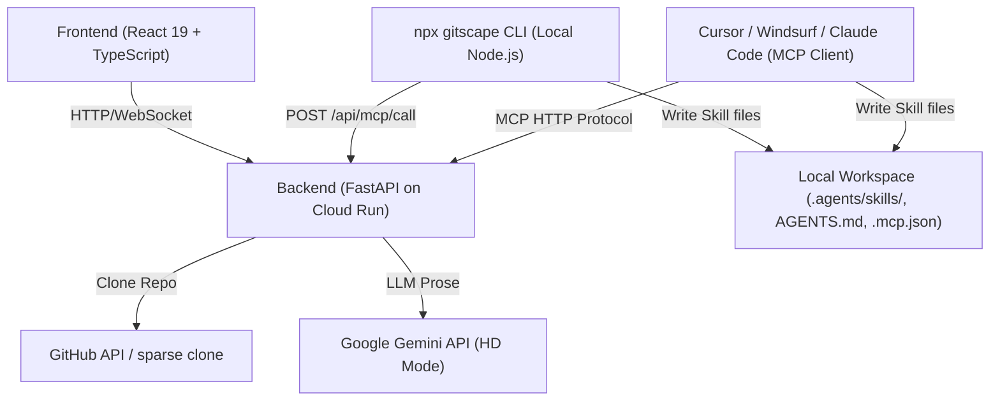

<h1 align="center">GitScape</h1>
<p align="center">
  
</p>
<p align="center">
  <strong>The open-source repository compiler, security gate, and Model Context Protocol (MCP) server for AI agents.</strong><br/>
  ⚡ Instantly compile any GitHub codebase into context-efficient, verified Agent Skills for Cursor, Windsurf, and Claude Code.
</p>
<p align="center">
  <a href="https://gitscape.ai/registry/jmxt3/gitscape.ai">
    
  </a>
  <a href="https://www.npmjs.com/package/gitscape">
    
  </a>
  <a href="https://www.npmjs.com/package/gitscape">
    
  </a>
  <a href="https://github.com/jmxt3/gitscape.ai/blob/main/LICENSE">
    
  </a>
</p>

<p align="center">
  <a href="https://gitscape.ai">gitscape.ai</a> •
  <a href="#-what-is-gitscape">What is GitScape</a> •
  <a href="#-key-features">Key Features</a> •
  <a href="#-architecture">Architecture</a> •
  <a href="#-mcp--cli-integration">MCP & CLI</a> •
  <a href="#-scapeguard-security-gate">ScapeGuard</a> •
  <a href="#-local-development">Development</a>
</p>

<br/>

---

## 🧠 What is GitScape?

**GitScape** is an open-source platform, developer tool, and Model Context Protocol (MCP) server that resolves the "token bloat" and safety challenges of pair programming with AI agents. 

Rather than feeding raw, unorganized source code to your AI assistant, GitScape compiles any public or private GitHub repository into a progressively-disclosed **Agent Skill** (`SKILL.md` + a structured `references/` directory) and a clean flat text **Code Digest**. This allows agents (Cursor, Windsurf, Claude Code, Agno, etc.) to comprehend complex codebases instantly at a fraction of the token cost.

GitScape is designed to be **stateless and database-free**—running all repository cloning, Tree-sitter parsing, and security audits on the fly in the request lifecycle.

---

## ✨ Key Features

*   🔌 **Model Context Protocol (MCP)** — A built-in MCP server that exposes `install_skill` and `uninstall_skill` tools directly to AI editors, allowing them to download and configure skills on your behalf.
*   ⚡ **Zero-Dependency CLI (`gitscape`)** — A lightweight Node.js utility to compile repositories, scan files, and manage local agent skill configurations on the fly.
*   🛡️ **ScapeGuard Security Gate** — Protects your agent workspace. Scans every compiled skill against **55+ static analysis rules** and **9 threat categories** mapped to the **OWASP Agentic Skills & LLM Top 10**, assigning an **A–F grade** and blocking dangerous packages.
*   📦 **Public Skill Registry & NVIDIA Curated Hub** — Explore, search, and download pre-compiled skills. Features a dedicated registry of **220+ curated NVIDIA AI and CUDA libraries** with rich metadata indexing domain, subdomain, and audience.
*   🗺️ **Interactive Code Visualizations** — Generate D3-powered interactive, zoomable codebase diagrams to explore repository structure and file dependencies visually.
*   📡 **WebSocket Streaming** — Real-time compilation with live streaming progress updates directly in your browser.
*   🔒 **Privacy-First Design** — Your GitHub Personal Access Tokens (PATs) stay in your local browser storage; GitScape never holds persistent state or writes data to disk across requests.

---

## 🏗️ Architecture

GitScape is structured as a monorepo containing three workspaces:

```
GitScape/
├── frontend/  # React 19 + TypeScript frontend (Vite, Tailwind CSS, D3)
├── backend/   # FastAPI backend (Python 3.10, Docker, Google Cloud Run)
└── cli/       # Node.js zero-dependency CLI (calls backend API, writes locally)
```

### High-Level System Flow



---

## 🧠 Agent Skills & SkillForge

The **SkillForge** pipeline parses a codebase digest and packages it into a high-quality, progressively-disclosed [Agent Skill](https://agentskills.io) using Tree-sitter for deterministic API signature extraction, code mining, and dependency parsing.

### Pipeline
```
ingest → parse → classify → extract → sanitize → assemble → scan (ScapeGuard Gate) → package
```

### Output Package Structure

When compiled and written, a skill contains:

```
<owner-repo>/
├── SKILL.md            # Token-budgeted entry point linking to references
├── references/         # Progressive disclosure documentation
│   ├── api.md          # Public API symbols, classes, and function signatures
│   ├── architecture.md # Monorepo, directory, and workspace layouts
│   ├── examples.md     # Mined, deduplicated code examples (excluding tests)
│   ├── setup.md        # Commands, prerequisites, and env vars
│   └── config.md       # Configuration files and JSON schemas
├── exporters/          # Autogenerated Google ADK + Agno wrappers
│   └── adk_wrapper.py
└── manifest.json       # Digest hash + provenance metadata + ScapeGuard scan status
```

### Compilation Tiers

| Tier | Output Description | Dependencies | Speed / Latency |
| :--- | :--- | :--- | :--- |
| **Standard** *(Default)* | Deterministically generated skill structure via Tree-sitter. | None | Instant, free |
| **HD** | Enriches the skill structure with LLM-generated prose description. | `GEMINI_API_KEY` (Server-side) | Low latency, high quality |

---

## 🛡️ ScapeGuard Security Gate

Because repository digests contain untrusted user code, prompt injections, hardcoded keys, or malicious execution blocks could exploit your AI agent's execution capabilities.

To counter this, GitScape routes every compilation and scan through **ScapeGuard**—a Python-based static analysis engine that checks **55+ rules** across **9 threat categories**, assigning an **A–F grade** and a numeric **Risk Score**.

### 📊 ScapeGuard Grading Scale
*   🟢 **Grade A** (Clean) — No findings. Installs automatically.
*   🟡 **Grade B** (Minor Warnings) — Low severity flags. Requires confirmation.
*   🟠 **Grade C** (Review Advised) — Multiple warnings. Requires explicit bypass (`--force` or manual consent).
*   🔴 **Grade F** (Blocked) — Critical vulnerabilities (e.g., hardcoded API keys or remote code execution commands) detected. Export and installation are **blocked** (`422 Unprocessable Entity`).

### 🗂️ The 9 Threat Categories
1.  **Prompt Injection** (`GS-INJ` / AST01 / LLM01) — System command overrides and instruction hijacking.
2.  **Secrets & Credentials** (`GS-SEC` / AST05 / LLM02) — Embedded API keys, tokens, and private keys.
3.  **Data Exfiltration** (`GS-EXF` / AST04 / LLM02) — Code exfiltrating details to external hosts.
4.  **Malicious Execution** (`GS-EXE` / AST02 / LLM05) — Destructive commands, shell execution, or remote scripts.
5.  **Supply Chain** (`GS-DEP` / AST03 / LLM03) — Typosquatted, unpinned, or compromised dependencies scanned via [OSV.dev](https://osv.dev).
6.  **Obfuscation** (`GS-OBF` / AST06 / LLM01) — Unicode homoglyphs, zero-width space payloads, or encoded text.
7.  **Untrusted Content** (`GS-CNT` / AST07 / LLM08) — Dynamic external fetches.
8.  **Excessive Agency** (`GS-AGY` / AST08 / LLM06) — Config tampering or safety-bypass flags.
9.  **Structure & Quality** (`GS-STR`) — Package verification and validation of file structures.

---

## 💻 MCP & CLI Integration

GitScape supports two ways of integrating skills directly into your local IDE workspace:

### 🔌 Model Context Protocol (MCP) Server

Exposes the compiler tools to Cursor, Windsurf, and Claude, allowing them to install, update, and uninstall skills on your behalf.

#### Setup in Cursor / Windsurf
1. Navigate to **Settings -> Models -> MCP**.
2. Click **+ Add New MCP Server**.
3. Configure the fields:
   *   **Name**: `GitScape`
   *   **Type**: `sse`
   *   **URL**: `https://gitscape-143600285956.us-central1.run.app/api/mcp` *(or `http://127.0.0.1:8081/mcp` for local development)*

#### Setup in Claude Desktop
Add this server block to your `claude_desktop_config.json`:
```json
{
  "mcpServers": {
    "gitscape": {
      "command": "npx",
      "args": [
        "-y",
        "gitscape",
        "init"
      ]
    }
  }
}
```

---

### 🚀 GitScape CLI

The CLI is a lightweight, zero-dependency Node utility to manage agent skills from your terminal.

```bash
# On-demand execution (Recommended)
npx gitscape [command] [options]

# Global installation
npm install -g gitscape
```

#### Commands & Workflows

1.  **Initialize local workspace config**
    Creates a local `.mcp.json` referencing the compilation server:
    ```bash
    npx gitscape init
    ```
2.  **Compile and install a skill**
    Packages a repository and writes it locally under `.agents/skills/<repo-slug>/`:
    ```bash
    npx gitscape https://github.com/owner/repo
    ```
    *If ScapeGuard returns Grade `F`, the installation is blocked. Override with `--accept-risk`.*
3.  **Scan a repository (without installing)**
    Runs security audits against a repository and exits non-zero if the scan fails (perfect for CI/CD gates):
    ```bash
    npx gitscape scan https://github.com/owner/repo
    ```
4.  **Remove a skill**
    Deletes the skill folder and cleans up local skill registries (`AGENTS.md` and `CLAUDE.md`):
    ```bash
    npx gitscape remove <skill-name>
    ```

---

## 🛠️ Local Development

### 1. Run the Frontend (React 19)

```bash
cd frontend
npm install
npm run dev
# Default: http://localhost:5173
```
*To point the UI to a local backend instead of the production API, create `frontend/.env.local`:*
```env
VITE_API_HOST=localhost:8081
```

### 2. Run the Backend (Python 3.10 + FastAPI)

The backend uses `uv` for package management.

```bash
cd backend
# Create and activate virtual environment
uv venv
source .venv/bin/activate  # On Windows: .venv\Scripts\activate

# Sync dependencies and configure environment
uv sync
cp .env.example .env

# Start FastAPI development server
uv run uvicorn main:app --reload --port 8081
# Swagger Docs: http://localhost:8081/docs
```

### 3. Run Backend Tests (pytest)

```bash
cd backend
uv run pytest -v
```

---

## 🐳 Docker Containers

Optimized Dockerfiles are provided for isolated deployments:

```bash
# Build and run Frontend
cd frontend
docker build -t gitscape_web .
docker run -p 8080:8080 gitscape_web

# Build and run Backend
cd backend
docker build -t gitscape_api .
docker run -p 8081:8081 gitscape_api
```

Refer to the workspace-specific README files in [frontend/README.md](file:///c:/Users/jmach/dev/GitScape/frontend/README.md) and [backend/README.md](file:///c:/Users/jmach/dev/GitScape/backend/README.md) for automated Cloud Build and Cloud Run deployment scripts.

---

## 🧑‍💻 Contributing

We welcome contributions to the GitScape compiler, security analyzer, and CLI client!

1. **Fork** the repository and create your feature branch:
   ```bash
   git checkout -b feature/cool-new-feature
   ```
2. Make your edits in the appropriate workspace (`frontend/`, `backend/`, or `cli/`).
3. Run test suites locally and ensure all files are linted.
4. Open a **Pull Request** with a detailed summary of your changes.

---

## 📚 Resources & Acknowledgements

*   [GitScape Website](https://gitscape.ai/)
*   [Gemini API Key Setup](https://ai.google.dev/gemini-api/docs/api-key)
*   [GitHub Personal Access Tokens](https://github.com/settings/tokens/new)
*   [FastAPI Documentation](https://fastapi.tiangolo.com/)
*   [Google Cloud Run](https://cloud.google.com/run/docs)

---

## 📝 License

This project is licensed under the [Apache License 2.0](LICENSE).

Third-party dependencies and derived static-analysis signatures are credited in [THIRD_PARTY_NOTICES.md](THIRD_PARTY_NOTICES.md) — notably the ScapeGuard security gate, which borrows patterns and rule configurations from the [NVIDIA SkillSpector](https://github.com/NVIDIA/SkillSpector) (Apache-2.0) project.

---

Created with ❤️ by [João Machete](https://github.com/jmxt3) and the open-source community. If you like GitScape, please ⭐️ the repo and share your feedback!

